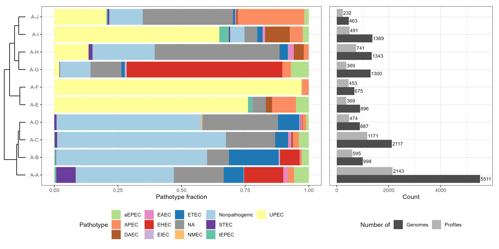
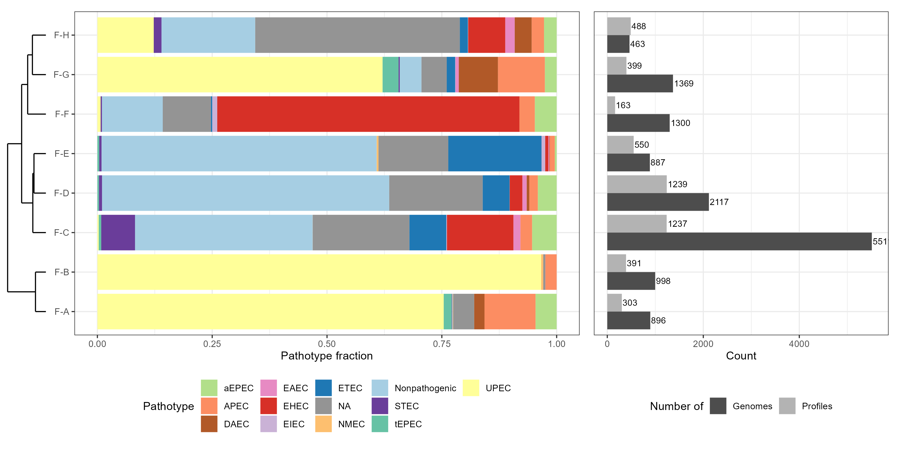
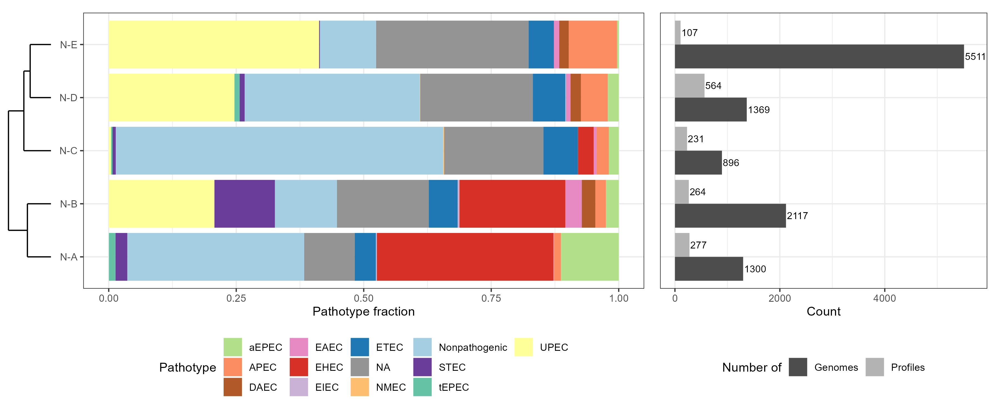

### Adhesin clusters

Clusters were defined based on unique adhesin presence/absence profiles and using three types of data subsets: (i) all – using all adhesin genes, (ii) fimbrial – considering only genes encoding fimbrial adhesins, (iii) nonfimbrial – based on genes encoding nonfimbrial adhesins. 

&ensp;

**Adhesins clusters**

Clusters A-A, A-B, A-C and A-D are characteristic of nonpathogenic, unknown, ETEC and STEC pathotypes. A-A and A-B also contain EHEC and tEPEC which are not found in A-C and A-D clusters. A-A cluster is also associated with a high prevalence of ehaG and Stg fimbriae. A-E and A-F clusters are closely related and comprised of UPEC strains in over 75%. A-G contains mostly one subtype of EHEC and its most distinct feature is the presence of long polar fimbriae. A-H, A-I and A-J comprise mainly UPEC, nonpathogenic and unknown strains in different proportions, with addition of DAEC and APEC. A typical feature of A-H cluster is the presence of aatB autotransporter.

&ensp;

**Fimbrial clusters**

Clusters F-A and F-B are closely related and consist mostly of UPEC strains with a high prevalence of F1C and UCL fimbriae. F-C, F-D and F-E create another closely related clade and contain mostly nonpathogenic, unknown and ETEC strains. F-C additionally includes a subset of STEC and EHEC and its characteristic feature is the presence of Stg fimbriae. On the other hand, a typical feature of F-D is a high prevalence of Yhc and Yad fimbriae. F-F is the smallest cluster characterized mainly by EHEC strains and presence of long polar fimbriae. F-G and F-H comprise primarily of UPEC and unknown with nonpathogenic strains, respectively. The adhesins specific for the former are Yfc and Ycb, whereas the most important features of the latter are genes encoding Yra fimbriae.

&ensp;

**Nonfimbrial clusters**

Nonfimbrial adhesin clusters form two main clades. The first includes N-A and N-B, both characterized by the presence of ehaA and ehaG. The most important genes in the N-A cluster are paa and intimin, whereas iha and flu are specific for N-B. They both contain STEC, nonpathogenic, unknown, ETEC, EHEC and aEPEC strains, but differ in presence of tEPEC, which are found in N-A, as well as UPEC and EAEC occurring in N-B. N-C is represented mostly by nonpathogenic and unknown strains often carrying yeeJ, aatA and ypjA. N-D is the biggest cluster characterized by a high prevalence of ehaG, cah and yeeJ. On the other hand, N-E constitutes the smallest cluster specific for UPEC, nonpathogenic, unknown and APEC strains with tia, cah, ycgV and ypjA being the most characteristic genes.
